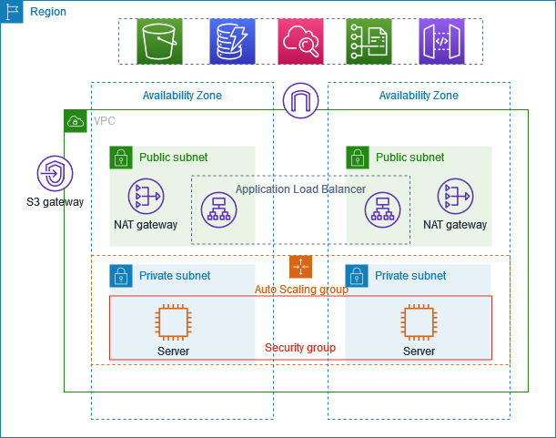

# AWS VPC Configuration
## (With Load Balancer and Auto Scaling Groups)

## Overview

This project demonstrates the design and implementation of a secure and scalable network infrastructure within AWS using a Virtual Private Cloud (VPC). The architecture includes both public and private subnets to achieve network segmentation and application isolation.

To provide high availability and controlled access to application servers, an Application Load Balancer (ALB) is deployed in the public subnet. The load balancer distributes incoming client requests to application servers hosted in private subnets through configured target groups.

Additionally, an Auto Scaling Group (ASG) is implemented to automatically adjust the number of EC2 instances based on workload demand, ensuring optimal application performance, fault tolerance, and cost efficiency.

## Project Objectives

Upon completion of this project, you will gain practical experience with the following AWS networking and infrastructure concepts:

- Designing and configuring a custom Virtual Private Cloud (VPC).
- Creating and managing public and private subnets for network segmentation.
- Configuring route tables and internet connectivity within a VPC.
- Implementing security controls using Security Groups.
- Deploying EC2 instances within isolated private subnets.
- Configuring Application Load Balancers and Target Groups to distribute traffic across multiple application servers.
- Implementing Auto Scaling Groups to automatically scale application capacity based on demand.
- Applying AWS best practices for security, availability, and scalability.
- Understanding how application workloads can be securely exposed to users without directly exposing backend servers to the internet.

## Technologies and Services used

- AWS Cloud
- VPC
- Load Balancer
- Public and Private Subnets
- Security Groups
- Target Groups
- EC2 instances
- Auto Scaling Groups
- Launch Template

## Architecture



## Workflow

### Traffic Flow

```text
Internet → Internet Gateway → ALB → Target Group → EC2 Instances
```

### Scaling Flow

```text
Launch Template → Auto Scaling Group → EC2 Instances
```

### Outbound Access

```text
EC2 Instances → Route Table → NAT Gateway → Internet
```