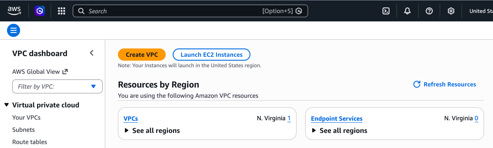

# VPC Creation

Navigate to AWS Console → VPC → Create VPC.

Select **VPC and More** and enter a name for the VPC.

Specify the IPv4 CIDR Block. This CIDR range determines the number of private IP addresses available within the VPC.

## Network Configuration

| Parameter | Value |
|------------|--------|
| Availability Zones | 2 or more for High Availability |
| Public Subnets | 1 per Availability Zone |
| Private Subnets | 1 per Availability Zone |
| NAT Gateway | 1 per Availability Zone |

## Subnet Usage

- **Public Subnets** host internet-facing resources such as Load Balancers and Bastion Hosts.
- **Private Subnets** host application and database servers that should not be directly accessible from the internet.

Configure NAT Gateway (1 per Availability Zone).

## Role of NAT Gateway

Configure NAT Gateway to enable outbound internet access for resources deployed in private subnets.

Common use cases include:

- Downloading software packages and updates.
- Accessing external APIs and repositories.
- Performing operating system updates.

Review the configuration and click **Create VPC**.

After successful creation, preview the architecture of the VPC from the **Resource Map** which provides a graphical view of the VPC architecture.

In the Resource Map, verify that both public subnets are associated with a Public Route Table. This route table should contain a route to the Internet Gateway (IGW), allowing resources in the public subnets to communicate with the internet.

Similarly, each private subnet should be associated with a Private Route Table. The private route tables should contain routes that point to their respective NAT Gateways, enabling outbound internet access for resources in the private subnets while preventing direct inbound access from the internet.

Ensure the final architecture matches the intended design, with public subnets connected through the Internet Gateway and private subnets accessing the internet through NAT Gateways.