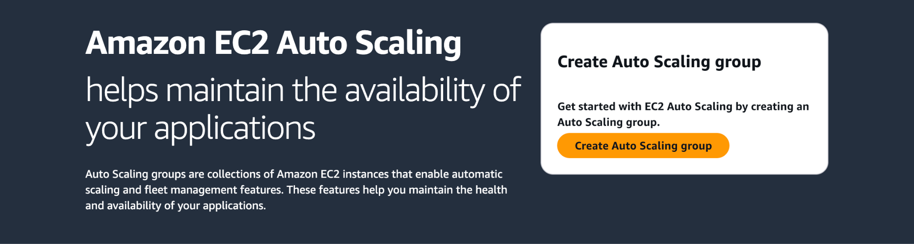
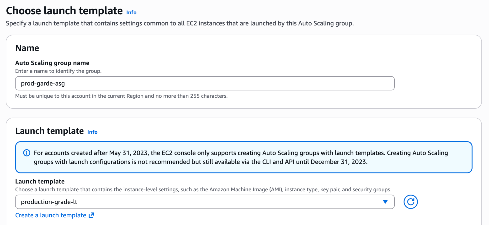
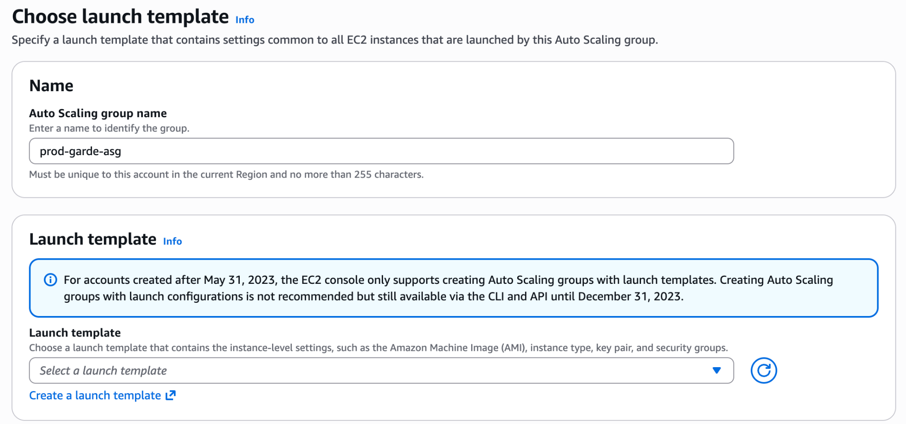
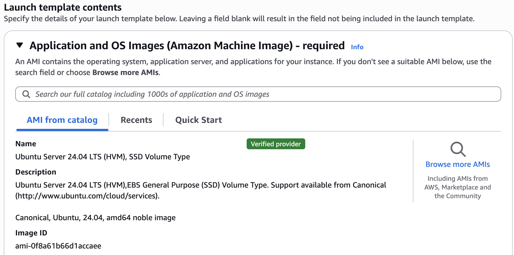
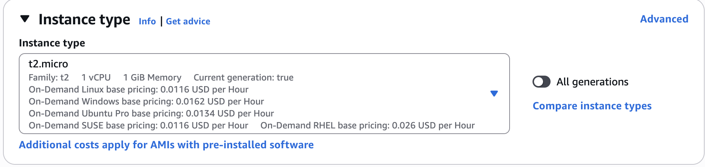
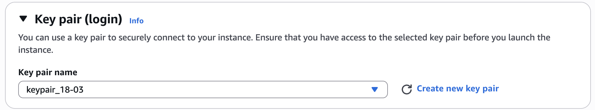
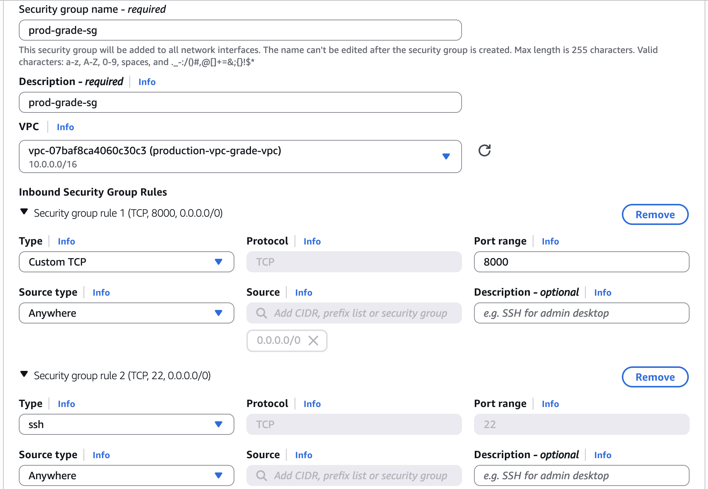
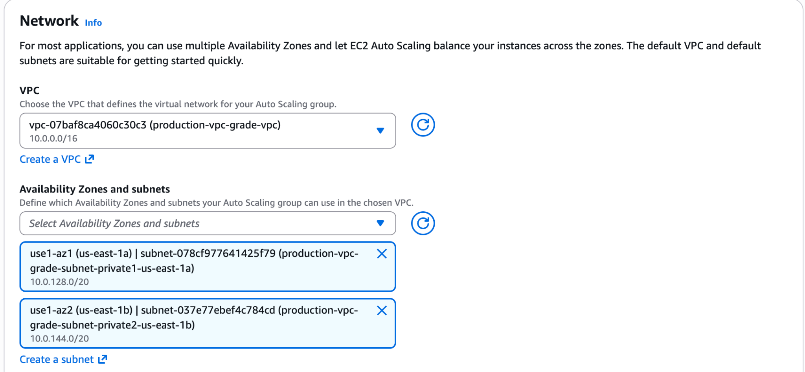
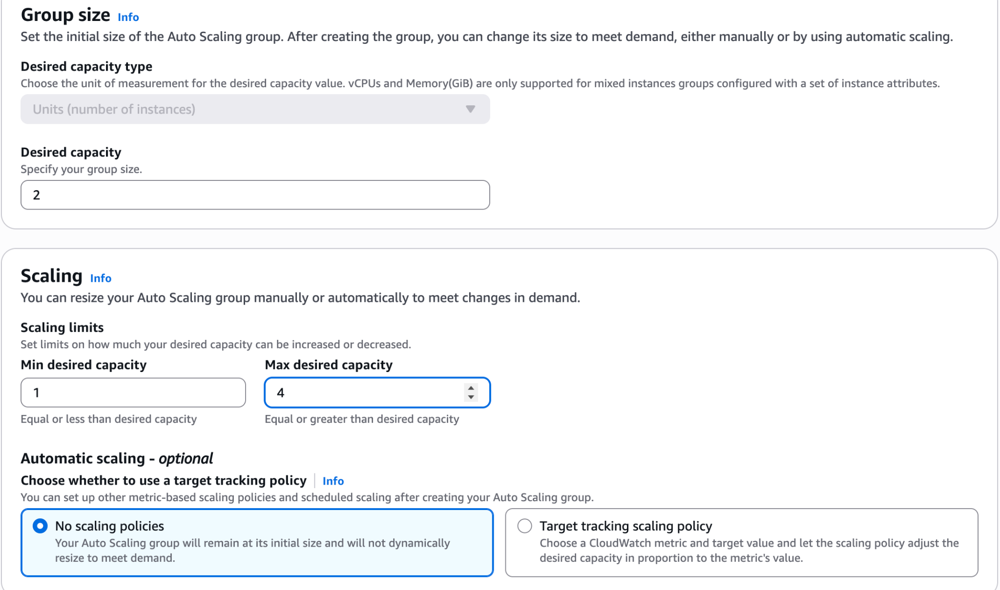
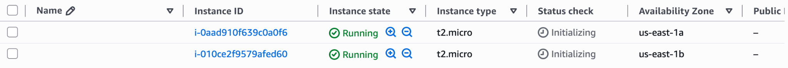

# Auto Scaling Group Creation

The Auto Scaling Group (ASG) is used to automatically provision, maintain, and scale EC2 instances based on the configured capacity requirements.

Go to **EC2 → Auto Scaling → Auto Scaling Groups**

Click on **Create Auto Scaling group**

Choose a name and select **Launch Template**. In case of no Launch templates, create a Launch Template that defines the configuration of the EC2 instances to be launched.

## Creating Launch Template

Provide your Launch template a name.

Under **Launch template Contents**, select the operating system image (AMI) to be used for instance creation.

Choose the appropriate instance type based on workload requirements.

Select an existing key pair for SSH access.

Under **Network settings → Create a Security Group**

- Provide the Security Group a name and description.
- Create a Security Group and associate it with the VPC created earlier.
- Configure the Inbound rules based on the application requirements. Here we are defining one for SSH access (22) and on which the application runs (8000).

Review the configuration and create the Launch Template.

Refresh the Auto Scaling Group’s Launch Template Section and select the Launch Template created in the previous step.

Under the network settings:

- Select the custom VPC created during the VPC setup.
- Select the private subnets across multiple Availability Zones.

The application instances are deployed in private subnets to prevent direct access from the internet and improve overall security.

Click **Next**.

For this project, skip the load balancer attachment step during ASG creation, as the Application Load Balancer will be configured separately in a later stage.

And for **Group Size (Desired Capacity, Minimum Capacity and Maximum Capacity)**, configure the desired capacity settings based on application requirements.

Click **Next**.

Continue through the remaining configuration pages and click **Create Auto Scaling Group**.

After the Auto Scaling Group is created:

Navigate to **EC2 → Instances**.

Verify that the instances have been launched successfully.

Confirm the following:

- Instances are deployed in the selected private subnets.
- Correct AMI and instance type are used.
- Security Group is attached correctly.
- Desired number of instances have been provisioned.
- Instances are distributed across the selected Availability Zones.

