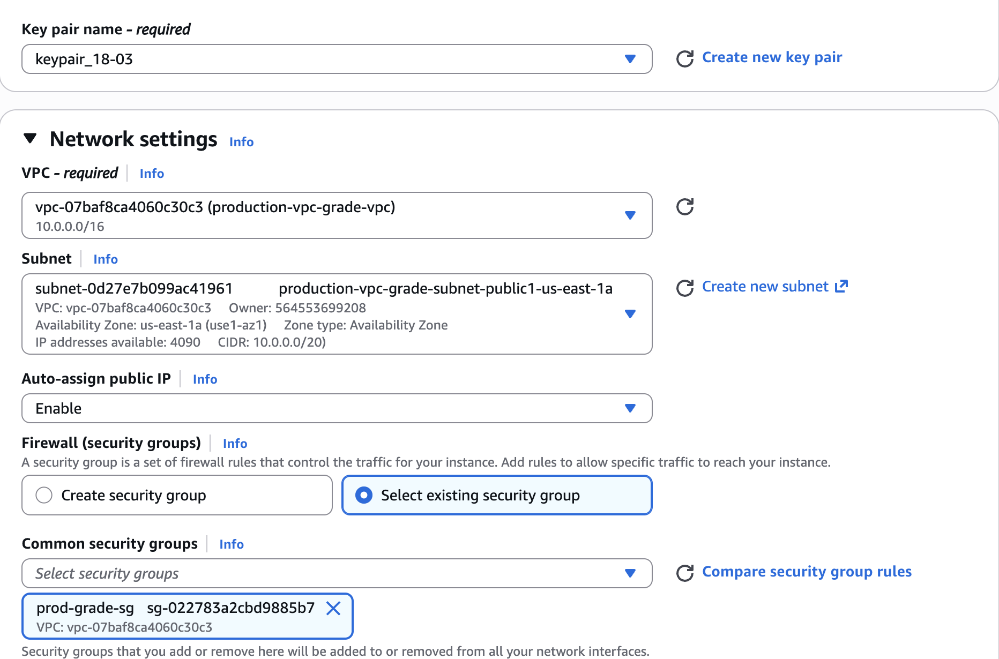
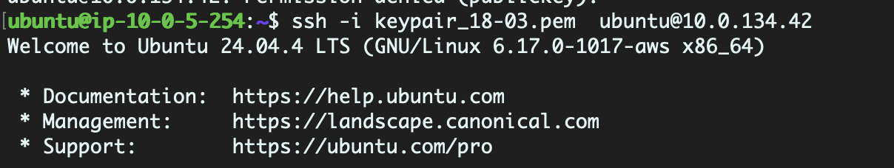
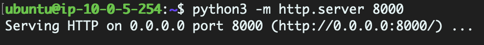

# Bastion Host Setup and Application Deployment

At this stage, the networking infrastructure and Auto Scaling Group have been configured. However, the application instances are deployed in private subnets and do not have public IP addresses assigned to them.

To securely access and manage (install applications) these private instances, a Bastion Host (also known as a Jump Server) is deployed in a public subnet.

## What is a Bastion Host?

A Bastion Host is a publicly accessible EC2 instance used as an entry point to access resources deployed in private subnets. Instead of exposing application servers directly to the internet, administrators first connect to the Bastion Host and then access the private instances from within the VPC.

This approach improves security by limiting direct external access to internal resources.


## Create a Bastion Host

Navigate to **EC2 Console → Instances**.

Click **Launch Instance**.

Provide a name for the instance.

Select the required AMI and instance type.

Choose the existing key pair.

### Network Configuration

Configure the instance with the following settings:

| Parameter | Value |
|------------|--------|
| VPC | Custom VPC created earlier |
| Subnet | Public Subnet |
| Public IP | Enabled |
| Security Group | Security Group with SSH access (Port 22) |

Add the same SG added to the VPC.

Launch the instance.



## Connect to the Bastion Host

SSH into the Bastion Host using its public IP address and the selected key pair.

**Example:**

```bash
ssh -i keypair.pem ubuntu@<BASTION_PUBLIC_IP>
```

## Copy the Private Key to the Bastion Host

Copy the private key required to access the application servers.

**Example:**

```bash
scp -i keypair.pem keypair.pem ubuntu@<BASTION_PUBLIC_IP>:/home/ubuntu
```

Verify that the key file is available on the Bastion Host and update its permissions if required.

```bash
chmod 400 keypair.pem
```


## Connect to Application Servers

From the Bastion Host, SSH into the private EC2 instances using their private IP addresses.

**Example:**

```bash
ssh -i keypair.pem ubuntu@<PRIVATE_IP>
```

Repeat the process for all application servers created by the Auto Scaling Group.



## Deploy and Run the Application

Copy the application files to the instance and start the application.

For a simple HTML-based application, navigate to the application directory and run:

```bash
python3 -m http.server 8000
```

This starts a web server on port 8000 and serves the application content.



Repeat the deployment process on all application instances that will be registered behind the Load Balancer.

Once the application is running on all instances, the environment is ready for Load Balancer configuration.