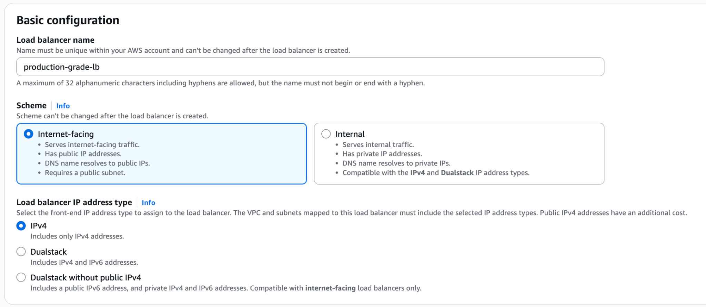
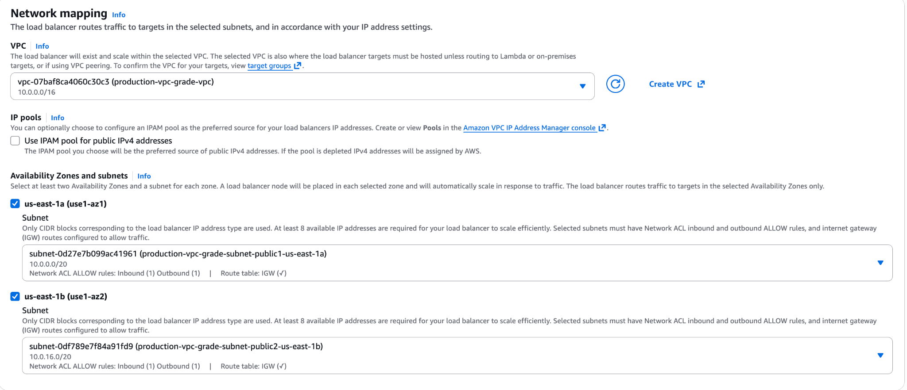
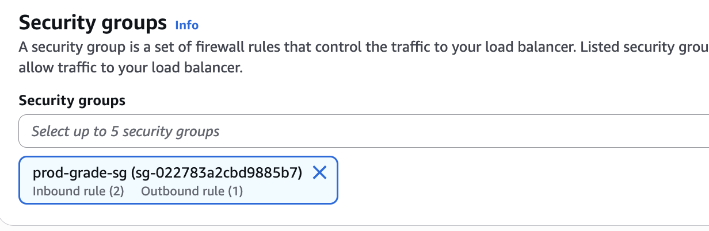
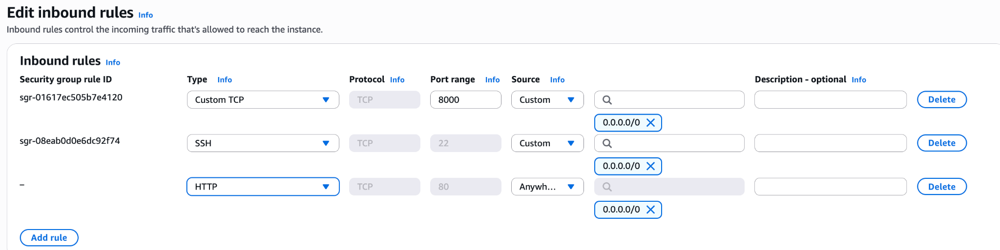
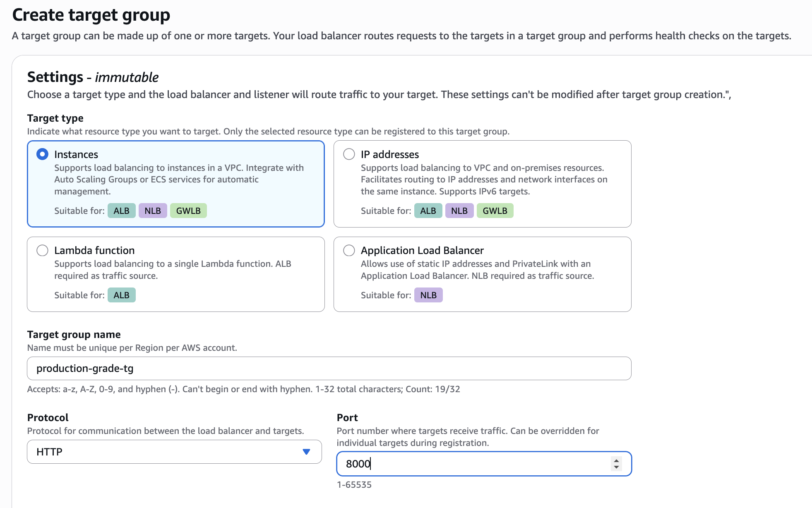
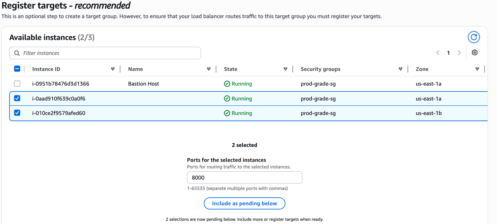
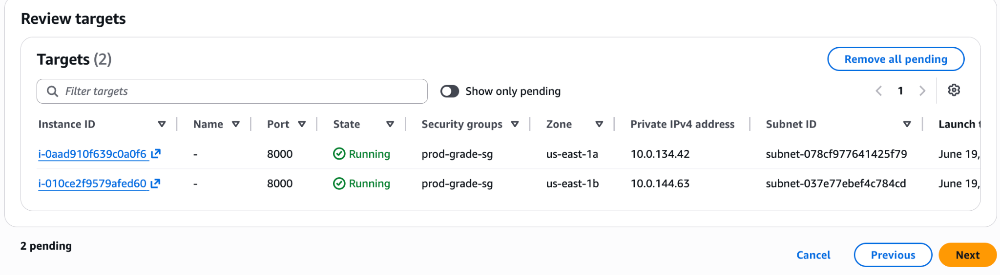
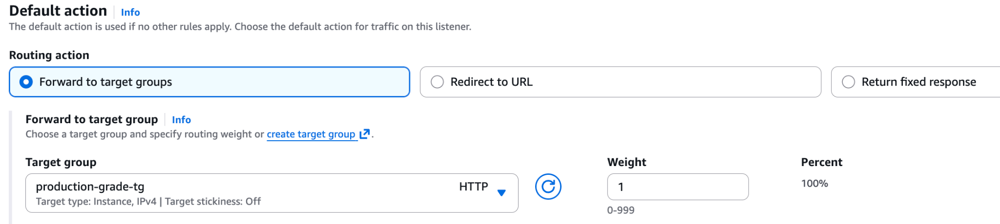
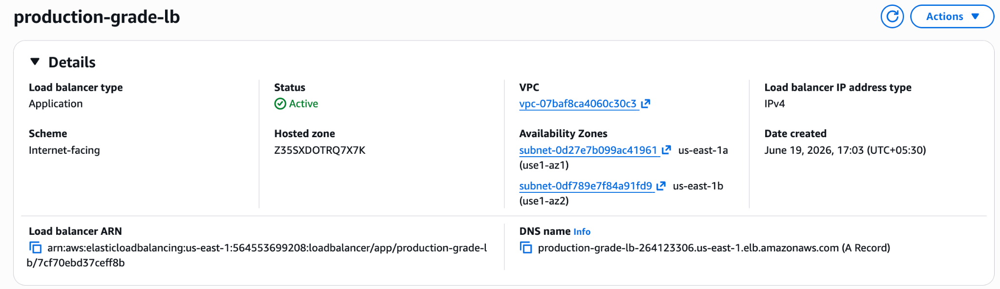
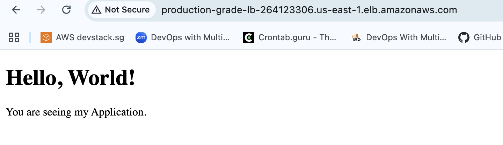

# Application Load Balancer Creation

The final step is to create an Application Load Balancer and register the application servers as targets. The Load Balancer acts as the entry point for incoming traffic and distributes requests across the backend application instances.

## Create an Application Load Balancer

Navigate to **EC2 Console → Load Balancers**.

Click **Create Load Balancer**.

Select **Application Load Balancer (ALB)**.


Provide a name for the Load Balancer.

Select **Internet-facing** as the scheme.

An Internet-facing Load Balancer receives requests from external users and routes them to the backend application servers.



## Configure Network Mapping

Configure the following network settings:

| Parameter | Value |
|------------|--------|
| VPC | Custom VPC created earlier |
| Availability Zones | Select the configured Availability Zones |
| Subnets | Public Subnets |



The Load Balancer nodes are deployed in the selected public subnets to allow internet access.

## Configure Security Group

Attach a Security Group that allows inbound HTTP traffic.

- Type: HTTP
- Protocol: TCP
- Port: 80

If the existing Security Group does not allow HTTP traffic, add the rule or create a new Security Group and attach it to the Load Balancer.



Since we would be exposing the Load Balancer which listens to port 80 (See the below step), we would need to add this as one of the rules in the Security Group, or create a new SG with that rule.



Under **Listeners and Routing**, configure the listener as **HTTP:80**.

The listener accepts incoming client requests and forwards them to the configured Target Group.


## Create a Target Group

A Target Group contains the backend instances that will serve application traffic via Load balancer.

Click **Create Target Group**.

Provide a name for the Target Group.

Select **Instances** as the target type.

Configure **Protocol** as HTTP and **Port** 8000.



The target port should match the port on which the application is running.

Click **Next**.

## Register Targets

Select the application instances created by the Auto Scaling Group.

Click **Include as Pending Below**.



Verify that all required application servers are listed as targets.

Click **Next** and create the Target Group.



Review and create the Target Group.

Once created, return to the Load Balancer configuration and select the newly created Target Group as the default routing target.



Review the configuration and create the Load Balancer.

AWS will provision the Load Balancer and perform health checks against the registered targets. Wait until the Load Balancer status changes to **Active** and the targets become **Healthy**.

## Verification

Navigate to **EC2 Console → Load Balancers**.

Open the created Load Balancer.

Copy the DNS Name provided by AWS.



Access the DNS name from a web browser.

**Example:**

```text
http://<LOAD_BALANCER_DNS_NAME>
```

If the Target Group health checks are successful and the application is running on the backend instances, the application page should be displayed through the Load Balancer.

